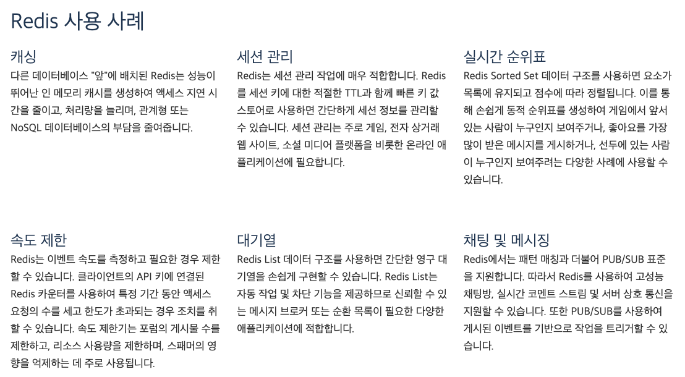

# backend-BOOST

### Week 01. Test with Concurrency 
- 동시성 문제와 테스트 코드 작성 요령 ~~/ 성능 테스트~~
- JUnit5, Mockito, JMeter

### Week 02. Redis

[Redis란 무엇입니까?](https://aws.amazon.com/ko/elasticache/what-is-redis/) - AWS
|김병현|김영섭|이승헌|전은평|조현수
|---|---|---|---|---|
|[대기열](https://github.com/peaches-book-study/backend-BOOST/issues/7)|[속도 제한](https://github.com/peaches-book-study/backend-BOOST/issues/2)|[채팅 및 메시징](https://github.com/peaches-book-study/backend-BOOST/issues/5)|[실시간 순위표](https://github.com/peaches-book-study/backend-BOOST/issues/6)|[세션 관리](https://github.com/peaches-book-study/backend-BOOST/issues/4)|

### Week 03. Spring (1)
Source : [토비의 스프링 3.1](https://product.kyobobook.co.kr/detail/S000000935360)

- [1장. 오브젝트와 의존관계]()
- [2장. 테스트]()
- [3장. 템플릿]()
- [4장. 예외]()

### Week 04. Spring (2)

- [5장. 서비스 추상화]()
- [6장. AOP]()
- [8장. 스프링이란 무엇인가?]()
- [9장. 스프링 프로젝트 시작하기]()

### Week 05. 네트워크

### Week 06. 운영체제

### Week 07. 데이터베이스 